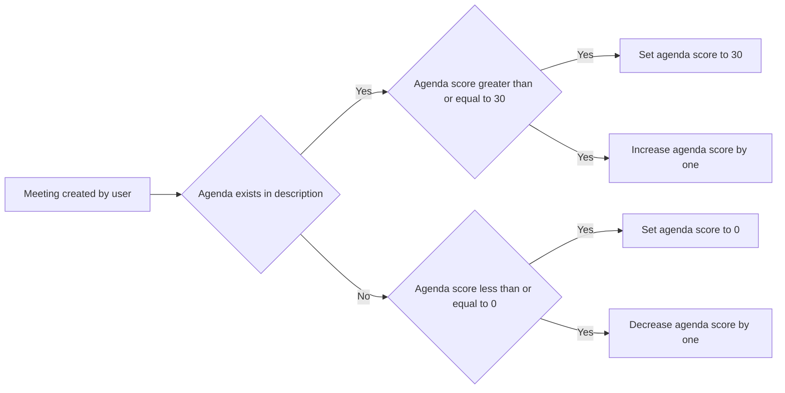

# Events

The following rules exist around Events.

## Agenda exists on meetings

```mermaid
graph LR
    A[Meeting created by user] -->B{Agenda exists in description}
    B -->|Yes| C{Agenda score greater than or equal to 30}
    C-->|Yes| D[Set agenda score to 30]
    C-->|Yes| E[Increase agenda score by one]
    B -->|No| F{Agenda score less than or equal to 0}
    F-->|Yes| G[Set agenda score to 0]
    F-->|Yes| H[Decrease agenda score by one]
```
